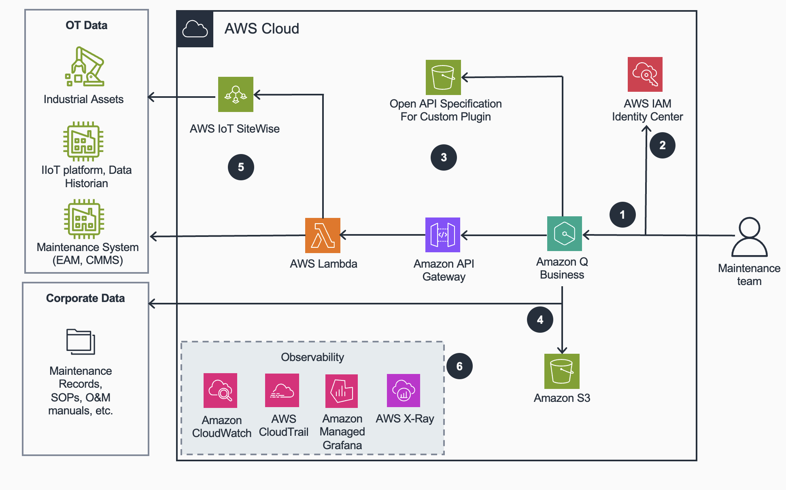

# Guidance For Assisted Diagnosis and Troubleshooting on AWS with Amazon Q

## Table of Contents

1. [Reference Architecture](#reference-architecture)
   - [Architecture Diagram Amazon Q](#architecture-diagram-amazon-q)
2. [Workshop](#workshop)
   

## Reference Architecture

### Architecture Diagram Amazon Q

### High-Level Overview and Flow

1. The maintenance team interfaces with **Amazon Q Business** through a conversational interface. **Amazon Q Business** uses **AWS IAM Identity Center** for authentication and authorization, ensuring secure access to the system and maintaining appropriate permissions for different user roles.

2. **AWS IAM Identity Center** manages access control and authentication for the solution. It ensures that maintenance team members can only access resources and perform actions based on their assigned roles and permissions. This integration with **Amazon Q Business** provides secure, role-based access to sensitive operational data and systems, while maintaining compliance with organizational security policies and industry standards. 

3. Through custom plugins, **Amazon Q Business** can access additional APIs using a standardized OpenAPI specification. These OpenAPI schemas, stored in **Amazon S3**, enable **Amazon Q Business** to understand API endpoints, parameters, and authentication requirements. This allows **Amazon Q Business** to dynamically construct appropriate API calls based on user queries and context. The plugin architecture leverages Amazon API Gateway to expose **AWS Lambda** functions, creating a seamless integration between the conversational interface and backend services.

4. **Amazon Q Business** seamlessly accesses Standard Operating Procedures (SOPs), Operations & Maintenance (O&M) manuals, and maintenance records through native connectors to **Amazon S3** and other document repositories through built-in [connectors](https://docs.aws.amazon.com/amazonq/latest/qbusiness-ug/connectors-list.html). This enables maintenance personnel to receive prescriptive guidance for specific industrial assets during troubleshooting sessions.

5. The telemetry plugin allows for the invocation of an AWS Lambda function with access to telemetry data from operational technology (OT) systems such as AWS IoT SiteWise or third-party industrial IoT (IIoT) platforms.
The maintenance plugin provides access to a Lambda function that can connect to a maintenance system to automatically create a work order based on the conversation history during the troubleshooting operation. The function can be extended to integrate with existing CMMS (Computerized Maintenance Management System) or EAM (Enterprise Asset Management) platforms.

6. The application can be monitored using **AWS CloudWatch** for metrics and logs, **AWS CloudTrail** for API activity tracking, **Amazon Managed Grafana** for visualization of operational metrics, and **AWS X-Ray** for distributed tracing and performance analysis, providing comprehensive observability across the entire solution.

## Workshop
Learn more about Assisted Diagnosis and Troubleshooting on AWS with Amazon Q through the [Building a Smart Factory with Amazon Q Workshop](https://catalog.workshops.aws/smart-factory-amazon-q/en-US)