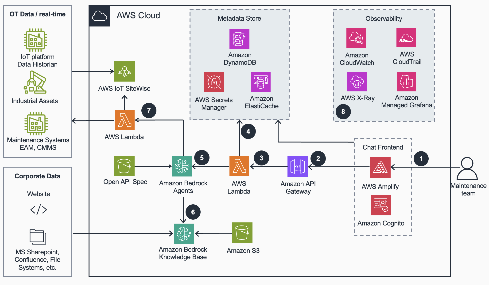
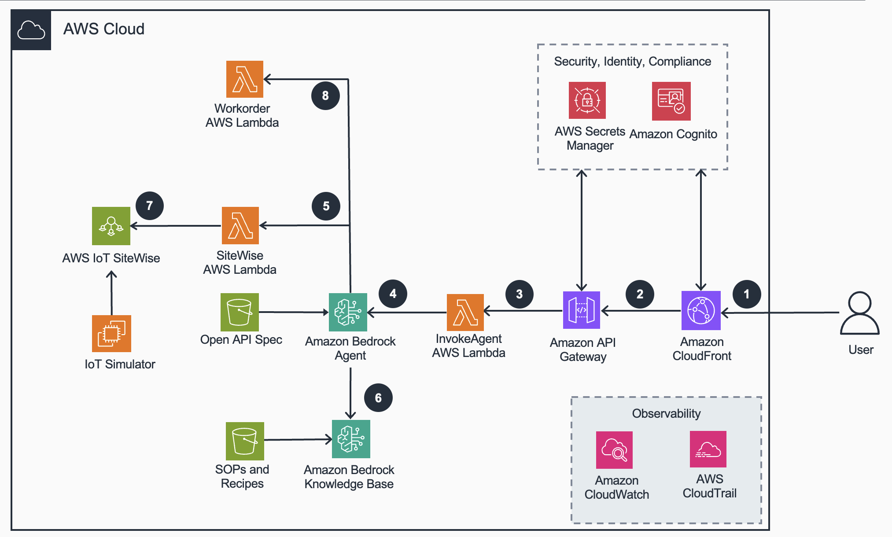
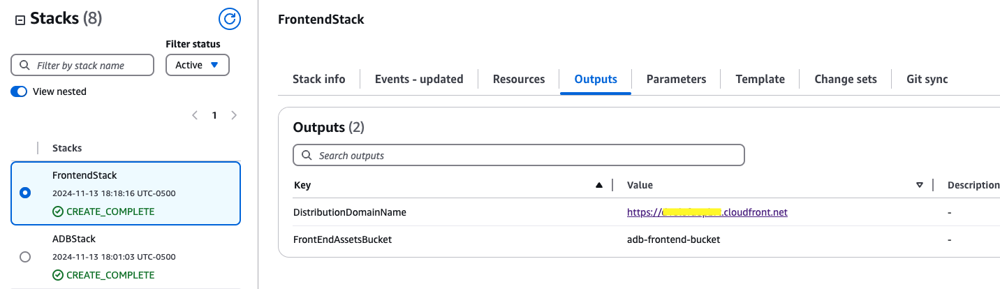
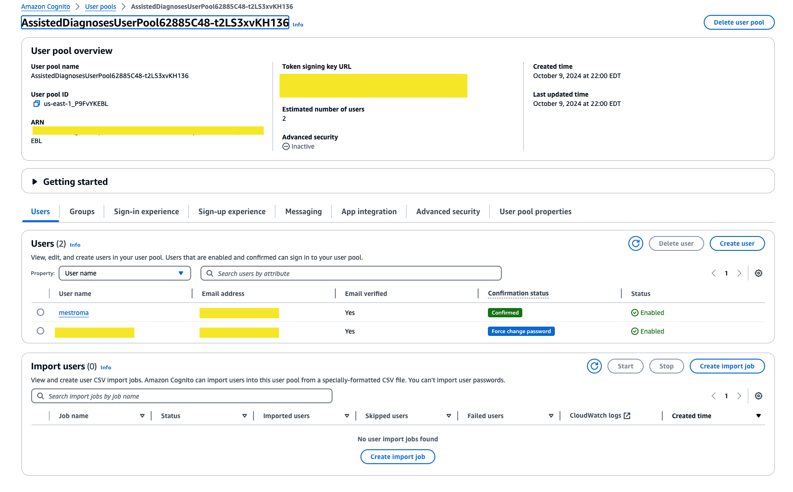

# Guidance For Assisted Diagnosis and Troubleshooting on AWS with Amazon Bedrock

## Table of Contents

1. [Reference Architecture](#reference-architecture)
   - [Architecture Diagram Bedrock RAG ](#architecture-diagram-bedrock-rag)
3. [Demo](#demo)
   - [Architecture](#architecture)
   - [Cost](#cost)
2. [Prerequisites](#prerequisites)
    - [Operating System](#operating-system)
3. [Deployment Steps](#deployment-steps)
4. [Deployment Validation](#deployment-validation)
5. [Running the Guidance](#running-the-guidance)
6. [Next Steps](#next-steps)
7. [Cleanup](#cleanup)
8. [FAQ, known issues, additional considerations, and limitations](#faq-known-issues-additional-considerations-and-limitations)
9. [Revisions](#revisions)
10. [Notices](#notices)
11. [Authors](#authors)


## Reference Architecture

> Architecture diagram presents a high-level conceptual overview of how the Assisted Diagnosis and Troubleshooting system functions on AWS. It illustrates the key AWS services involved, their interactions, and how they collectively enable AI-powered troubleshooting.


### Architecture Diagram Bedrock RAG 




### High-Level Overview and Flow

1. The maintenance team interfaces with the conversational interface hosted on a chat frontend, powered by **AWS Amplify**. **AWS Amplify** integrates with **Amazon Cognito** to handle authentication, ensuring that only authorized users can access the application and securely log in.

2. Once authenticated, user requests are routed through **Amazon API Gateway**, which serves as the front door for all incoming API calls. This setup allows for centralized access control, request throttling, and integration with AWS services.

3. **Amazon API Gateway** forwards the requests to an **AWS Lambda** function. This Lambda function is designed to handle conversational flows, process incoming user promts, and invoke **Amazon Bedrock Agent** with the user prompt to retrieve and process information to assist maintenance team with troubleshooting and diagnostics.

4. LLM configuration and conversation history is stored in **Amazon DynamoDB**. **Amazon ElasticCache** is used to cache responses to repeated queries, optimizing response times and reducing costs by minimizing redundant processing. **AWS Secrets Manager** securely stores credentials and sensitive information needed to interact with external systems, ensuring compliance with security best practices and seamless integration with external data sources.

5. The **Amazon Bedrock Agent** orchestrates and executes multistep tasks leveraging LLM reasoning capabilities. During the reasoning process, the agent identifies the necessary steps for effective diagnosis and troubleshooting. It performs Retrieval-Augmented Generation (RAG) on SOPs, recipes, user manuals, and other documents stored in the **Amazon Bedrock Knowledge Base** or automatically invokes the **AWS IoT SiteWise** API to retrieve real-time IoT data. The agent dynamically assesses whether to proceed with the task or gather additional information to successfully fulfill the request.

6. **Amazon Bedrock Knowledge Base** provides the entire RAG workflow from ingestion to retrieval and prompt augmentation to provide the application with context from corporate data (standard operating procedures, operating and maintenance manuals, etc.) stored on corporate systems or **Amazon S3**

7. **AWS Lambda** functions are invoked to interact with **AWS IoT SiteWise** APIs where real-time IoT data resides and maintenance systems (in the cloud or on-premises) to access and create work orders

8. **Amazon CloudWatch**, **AWS CloudTrail**, **AWS X-Ray**, and **Amazon Managed Grafana** provide comprehensive monitoring, logging, tracing, and visualization capabilities to monitor the application


## Demo
### Architecture

> Architecture diagram represents the actual deployment architecture of this guidance package. It shows the specific AWS resources that will be provisioned when you follow the deployment steps, including the infrastructure, configurations, and services instantiated by the provided code repository.




### Cost
> **Disclaimer**  
> This is an estimated cost for a smaller production workload based on this guidance. You can use it as a reference to calculate costs for similar workloads. Please adjust the assumptions to fit your specific scenario when calculating your final cost. This estimate does not reflect the cost of running the demo in your account.


| Description | Service | Upfront [USD] | Monthly [USD] | First 12 months total [USD] | Configuration summary |
|-------------|----------|--------------|--------------|----------------------------|-------------------------|
| Bedrock Embedding | Amazon Bedrock | 0 | 10 | 120 | 100,000 input tokens per month. |
| Cognito Secrets | AWS Secrets Manager | 0 | 1.3 | 15.6 | 100,000 input tokens per month. |
| AWS IoT SiteWise model | AWS IoT SiteWise | 0 | 53.41 | 640.92 | 20 sensors with 864,000 daily measurements, 1,728,000 daily egress API messages, 14,400 metric computations per day. |
| Document Storage | S3 Standard | 0 | 7.04 | 84.16 |  300 GB storage, 1 GB data returned, 50 GB data scanned by S3 Select monthly. |
| Bedrock Knowledge Base| Amazon OpenSearch Service | 0 | 700.82 | 8409.84 | 2 indexing OCUs, 2 search OCUs, 100 GB index data. |
| User Authentication | Amazon Cognito| 0 | 50.75 | 609 | 1,000 monthly active users, advanced security enabled.|
| EC2 instance hosting Sitewise Simulator | Amazon EC2 | 0 | 33.87 | 406.44 | 1 t2.medium instance, on-demand pricing, 100% utilization. |
| Sitewise Action Group | AWS Lambda | 0 | 0 | 0 | 	x86 architecture, 512 MB ephemeral storage, 100,000 requests per month. |
| Workorder Agent Group | AWS Lambda | 0 | 0 | 0 | 	x86 architecture, 512 MB ephemeral storage, 100,000 requests per month. |
| LLM utilized by Bedrock Agent | Bedrock Claude Haiku | 0 | 1500 | 18,000 | On-demand pricing, 1,000,000 input tokens, 1,000,000 output tokens per month. |


## Prerequisites

### Operating System

Super-easy Deployment leverages a combination of CDK and CloudFormation templates internally. If you are deploying the demo from your local machine:

- Ensure that **Docker** and a **Node.js runtime environment** are installed.

This deployment has been tested on **Unix-based operating systems (macOS)**. If you are using a **Windows machine**, ensure you have a compatible **Bash environment** set up (e.g., using Git Bash, Windows Subsystem for Linux (WSL), or similar).


### Third-party tools

Before deploying the guidance code, ensure that the following required tools have been installed:
- AWS Cloud Development Kit (CDK) >= 2.126.0
- Python >= 3.8


### AWS account requirements

**Required resources:**

- [Bedrock Model access](https://docs.aws.amazon.com/bedrock/latest/userguide/model-access.html) for Claude 3 Haiku and Amazon Titan Multimodal embeddings
- AWS CLI
- [AWS CDK](https://docs.aws.amazon.com/cdk/v2/guide/getting_started.html)

### Requesting Access to AWS Bedrock

1. Log in to the AWS Management Console
2. Search for "Bedrock" in the search bar
3. Click "Get Started" on the Amazon Bedrock service page
4. Click "Manage Model Access" in the popup
5. Select "Amazon" from the list of available models
6. Click "Request Model Access" at the bottom of the page

### Supported Regions

The the services used in this guidance do not support all regions, hence the guidance package is well suited to be deployed in `us-east-1` region.

### aws cdk bootstrap

This guidance uses AWS CDK. If you are using aws-cdk for the first time, please see the [Bootstrapping](https://docs.aws.amazon.com/cdk/v2/guide/bootstrapping.html) section of the AWS Cloud Development Kit (AWS CDK) v2 developer guide, to provision the required resources, before you can deploy AWS CDK apps into an AWS environment.

## Deployment Steps
1. Clone the repository:
   ```
   git clone https://github.com/aws-samples/guidance-assisted-diagnosis-and-troubleshooting.git
   ```

2. Navigate to the folder: source using
   ```
   cd bedrock/source
   ```

3. This project is a Python project. Switch to the virtual environment using the below command:
   ```
   python3 -m venv .venv
   ```

4. After the init process completes and the virtualenv is created, you can use the following step to activate your virtualenv. Execute the following to activate the environment: 
   ```
   source .venv/bin/activate
   ```

5. Install the required dependencies in the virtual environment. Please make sure you have installed aws cdk following the pre-requisites :
   ```
   python -m pip install -r requirements.txt
   ```

6. Initialize CDK within the project using the command:
   ```
   cdk init
   ```

7. Bootstrap the CDK environment using the command:
   ```
   cdk bootstrap
   ```

8. Verify that the CDK deployment correctly synthesizes the CloudFormation template:
   ```
   cdk synth
   ```

9. Deploy the Backend and Frontend Stack with the following command:
   ```
   chmod +x ./deploy.sh 

   ./deploy.sh 
   ```

10. Build the frontend application and upload assets to S3 bucket:
      ```
      cd front-end/

      chmod +x ./deploy.sh 

      ./deploy.sh 
      ```

## Deployment Validation
- To verify a successful deployment of this guidance, open [CloudFormation](https://console.aws.amazon.com/cloudformation/home) console, and verify that the status of the stacks named `SiteWiseAssetsStack`,`SimulatorServerStack`, `ADBStack`, `FrontendStack`  is `CREATE_COMPLETE`.
- Once the project is deployed, AWS assets are created in your application. You can navigate to AWS CloudFormation console and click on aforementioned stacks. Now you can click on `resources` tab which shows all the resources created by the stack.

## Running the Guidance
- Once stacks are deployed and assets are created, open [CloudFormation](https://console.aws.amazon.com/cloudformation/home) console, select `FrontendStack` and click on the Outputs tab to find url of deployed application. You can use that url to open application in the browser.



- After opening the app in your browser, you will be presented with login page. In order to login, you need to create a user in Amazon Cognito. With a user pool, your users can sign in to your web or mobile app through Amazon Cognito.

- **Create a new user in Amazon Cognito**
  - Go to the [Amazon Cognito console](https://console.aws.amazon.com/cognito/home) . If prompted, enter your AWS credentials.
  - Navigate to user pools on the left side of the panel. You should see a user pool created via CDK stack.
  - Click on the pre-created user pool. You will land on the image shown below:
   
  - As shown in the image, you can click on `Users` tab below `Getting Started` section and click on `create user` to create your user profile.
  - Now, create a new user by providing username, valid email address and temporary password to login to the application.
  - After this setup, you should be able to login and launch your application!


## Guidance Demo


To run the demo yourself, refer to the demo script available in the repository:
[Demo Script](/bedrock/demoscript/demoscript.md)


## Cleanup

### Cleanup of CDK-Deployed Resources

1. **Terminate the CDK app**:
   - Navigate to the source directory, it should be the same directory from where you ran the `./deploy.sh` command.
   - Run the following command to destroy the CDK stack and all the resources it manages:
   ```
   chmod +x ./destroy.sh 
   ./destroy.sh
   ```
   - This will remove all the AWS resources created by the CDK app and Cloudformation templates

2. **Verify resource deletion**:
   - Log in to the AWS Management Console and navigate to the relevant services to ensure all the resources have been successfully deleted.


## FAQ, known issues, additional considerations, and limitations
   - The dashboard currently displays only the Roaster Asset for demonstration purposes. It does not support multiple assets in its current implementation.


## Revisions

All notable changes to the version of this guidance package will be documented and shared accordingly.

## Notices

Customers are responsible for making their own independent assessment of the information in this guidance. This guidance: (a) is for informational purposes only, (b) represents AWS current product offerings and practices, which are subject to change without notice, and (c) does not create any commitments or assurances from AWS and its affiliates, suppliers or licensors. AWS products or services are provided “as is” without warranties, representations, or conditions of any kind, whether express or implied. AWS responsibilities and liabilities to its customers are controlled by AWS agreements, and this Guidance is not part of, nor does it modify, any agreement between AWS and its customers.

## Authors

- Marin Mestrovic
- Gabriel Verreault